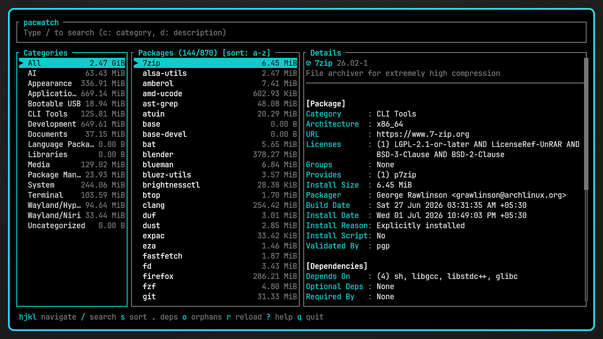

# pacwatch

A fast terminal UI for exploring installed Arch Linux packages through your own categories.

Instead of scrolling through a flat `pacman -Q` list, **pacwatch** lets you organize packages into categories such as *Development*, *Networking*, *Terminal*, *Media*, or anything else you define in `categories.toml`, making it easier to understand what is installed and why.

It reads the local pacman database directly — no `libalpm`, daemon, or external services required.

## Screenshot



## Installation

### From a release

Download the latest binary from the [Releases page](https://github.com/IntrovertInsaan/pacwatch/releases), make it executable, and run it:

```bash
chmod +x pacwatch
./pacwatch
```

> Prebuilt binaries are built for x86_64 Linux and are unsigned.
> If you'd rather verify the build yourself, use the source
> installation method below.

### From source

```bash
cargo build --release
```

or

```bash
cargo run --release
```

On first launch, pacwatch creates:

```text
~/.config/pacwatch/categories.toml
```

Edit this file to organize your packages.
Press **R** inside the application to reload changes instantly.

---

## Command-line options

| Flag              | Description                            |
| ----------------- | --------------------------------------- |
| `--config-path`    | Print the configuration file location  |
| `--reset-config`   | Restore the default configuration      |

---
## Keybindings

### Navigation

| Key        | Action                     |
| ---------- | -------------------------- |
| `h` / `l`  | Move between panes         |
| `j` / `k`  | Move between selection       |
| `gg` / `G` | Jump to top / bottom       |

### Search

| Key        | Action                     |
| ---------- | -------------------------- |
| `/`        | Search packages             |
| `d:<text>` | Search descriptions         |
| `c:<text>` | Search categories           |
| `Enter`    | Finish search                |
| `Esc`      | Cancel search                |

### Categories

| Key        | Action                     |
| ---------- | -------------------------- |
| `a`        | Create category             |
| `r`        | Rename category             |
| `d`        | Delete category             |
| `Space`    | Mark package                 |
| `Enter`    | Move marked packages         |
| `M`        | Clear all marked packages    |

### Packages

| Key        | Action                     |
| ---------- | -------------------------- |
| `s`        | Cycle sort: name/size/new  |
| `.`        | Toggle dependencies         |
| `o`        | Toggle orphans               |
| `R`        | Reload categories.toml       |

### General

| Key        | Action                     |
| ---------- | -------------------------- |
| `?`        | Help                       |
| `q`        | Quit                         |
---

## Configuration

Packages are grouped using a simple TOML file.

Example:

```toml
[Development]
packages = [
    "rust",
    "cargo",
    "git"
]

[Terminal]
packages = [
    "tmux",
    "zsh",
    "fzf"
]
```

Anything not listed automatically appears under **Uncategorized**.

---

## How it works

pacwatch reads package metadata directly from

```text
/var/lib/pacman/local/
```

and builds an in-memory view of your installed packages.

Reverse dependencies are computed automatically by scanning package dependency information — no extra database is maintained.

---

## Scope

pacwatch intentionally focuses on **exploration**, not package management.

It does **not**:

- install packages
- remove packages
- interact with the AUR
- modify your system

Its job is to help you understand what's already installed.

---

## Utility script

```bash
scripts/check-coverage.sh
```

Reports packages that are still uncategorized so you can keep your configuration complete.
